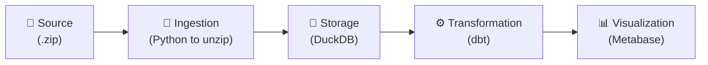
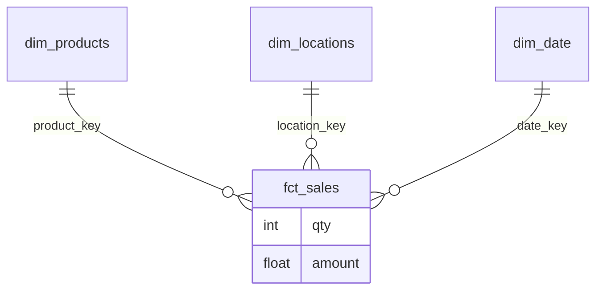
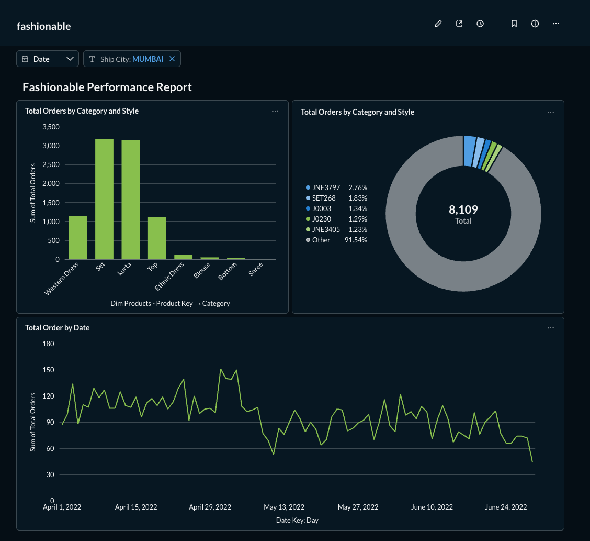

# Fashionable Data Pipeline
Analytics Engineering Assessment

**Prepared by:** Rhyando
**Stack:** DuckDB, dbt, Metabase, Python

  Press Space to begin <carbon:arrow-right />

  <button @click="$slidev.nav.openInEditor()" title="Open in Editor" class="slidev-icon-btn">
    <carbon:edit />
  </button>
  <a href="https://github.com/yourusername/fedex_fashionable" target="_blank" class="slidev-icon-btn">
    <carbon:logo-github />
  </a>

---
layout: two-cols
layoutClass: gap-16
transition: fade-out
---

# Agenda

<Toc minDepth="2" maxDepth="2" class="mt-8 text-xl" />

::right::

  
"Design a data warehouse using the Kimball star schema model, aimed at facilitating marketers' analytical tasks."

---
transition: slide-up
level: 2
---

## Requirements & Principles

To ensure the solution meets the business needs, the following core requirements guided the pipeline design:

### ⚙️ Functional Requirements
- **Transformation:** Must use **dbt** and **SQL**.
- **Modeling:** Design a **Kimball Star Schema** data warehouse.
- **Integration:** Must be seamlessly connected to a **BI Tool** (Metabase).

### 🌟 Non-Functional Requirements
- **User Friendliness:** The data warehouse and BI layer must be highly intuitive, aimed at facilitating marketers' analytical tasks without friction.
- **Data Quality:** Need to ensure data quality for better trust from the marketer.

---
transition: slide-up
level: 2
---

## How did you explore the data?

Before building models, I needed to understand the shape, grain, and quality of the raw CSV.

### 🛠 Tools Used
- **Python (Pandas):** Initial load and inspection.
- **YData Profiling:** Automated statistical audit.
- **DuckDB:** Quick SQL ad-hoc queries.
- **Excel:** for quick raw data exploration

The profiling can be found here: <a href="file:///Users/rhyando/code/fedex_fashionable/ingestion/data_audit.html" target="_blank">ingestion/data_audit.html</a>

### 🔍 Key Findings
- **Grain:** One row per order line item.
- **Volume:** ~128,975 rows.
- **Data Issues:**
  - There is no unique row id and the column `index` is not a standard row id
  - `date` column in MM-DD-YY format is not standard and consistent.
  - Column `Unnamed: 22` has no actual meaning.
- **Missing Values:**
  - Missing `ship-city` fields.
  - 6.0% missing values in `Amount`.

  <carbon:idea /> <strong>Takeaway:</strong> There are a lot of data quality implementation that hasn't been found. Only after more exploration, it can only be found and implemented.

---
level: 2
---

## High-Level Architecture & Ingestion Flow

The data pipeline is designed to be simple, reproducible, and fully local.

 

### Workflow Breakdown:
1. **Source:** The assessment provided raw data in a compressed format.
2. **Ingestion:** A Python script automatically extracts the `.zip` file and loads the raw `.csv` into DuckDB.
3. **Transformation:** dbt takes over to clean, deduplicate, and model the data into a Kimball Star Schema.
4. **Visualization:** Metabase connects directly to the local DuckDB database to serve dashboards to the marketeers.

---
level: 2
---

## How did you clean the data?

Data cleaning was handled systematically across two layers:
- **Python Ingestion**: mainly used as automatic pandas column schema and put data to duckdb.
- **dbt Staging (Silver)**: Cleaning up mainly done in the silver layer.

<v-click>

 

List of changes:

- **Standardization:** Converted column names to `snake_case` during ingestion.
- **Data Types:**
  - Explicitly cast dates to `DATE` types in dbt from MM-DD-YY to normal YYYY-MM-DD.
  - Change format such as `Amount` to `FLOAT` and `ship-postal-code` to `INT`.
- **Handling Nulls:** Monitored missing columns such as `Amount` values (6%). Imputed or filtered where necessary.
- **Deduplication:** Applied window functions in DuckDB to eliminate duplicated order lines.
- **Remove:** Removing the first date of the data due to unusually low value.

</v-click>

---
layout: default
---

## Facts and Dimensions Reasoning

To support the marketing team, I designed a **Kimball Star Schema** to make querying intuitive and performant.

  

  ### 🟢 Fact Table
  **`fct_sales`**
  - **Grain:** One row per order line item.
  - **Measures:** Quantity, Amount.
  - **Keys:** `order_id`, `product_key`, `location_key`, `date_key`.

  

  

  ### 🔵 Dimension Tables
  - **`dim_products`**: Product attributes (`sku`, `category`, `style`, `size`, etc).
  - **`dim_locations`**: Shipping destinations (`ship_city`, `ship_state`, etc).
  - **`dim_date`**: Calendar attributes (`month`, `quarter`, `season`, etc).

  

---
layout: default
---

## How did you set up dbt?

The dbt project is organized following dbt Labs' best practices.

  <ul class="mt-4 space-y-2">
    <li v-click><b>Adapter:</b> <code>dbt-duckdb</code> for fast, local, analytical querying.</li>
    <li v-click><b>Sources (Bronze Layer):</b> Defined <code>source.yml</code> pointing to raw data already in DuckDB. It also include <code>stg_</code> which is minor adjustment.</li>
    <li v-click><b>Silver Layer:</b> <code>dim_</code>, and <code>fct_</code> models to clean, deduplicate, and build the core star schema.</li>
    <li v-click><b>Golden Layer (Marts):</b> <code>mart_</code> models containing business-level aggregations directly for BI.</li>
  </ul>

dbt/models/ 
├── bronze/ 
│   ├── _silver_models.yml 
│   ├── stg_sales.sql 
├── silver/ 
│   ├── dim_locations.sql 
│   ├── dim_date.sql 
│   ├── dim_products.sql 
│   └── fct_sales.sql 
├── gold/ 
│   └── mart_sales.sql 
│   └── obt_sales.sql 

---
layout: default
---

## Preparing Data for BI & Answering Marketeers

The dimensional model directly answers the core business questions.

  <h3 class="text-blue-800 !mb-2 !text-lg">Q: Popular in Mumbai?</h3>
  
Filter <code>dim_locations.ship_city = 'MUMBAI'</code>. Group by <code>dim_products.style</code> and <code>category</code>, summing <code>fct_sales.qty</code>.

  <h3 class="text-green-800 !mb-2 !text-lg">Q: Seasonal Sales Trend?</h3>
  
Join <code>dim_date</code> and group by <code>season</code>. Sum <code>fct_sales.amount</code> to visualize gross revenue trends.

**BI Integration (Metabase):**
- Connected Metabase directly to the DuckDB file.
- Created fact and dimension in silver layer for marketer who want to tap into the raw table.
- Created `mart_sales` in gold layer containing aggregated data from raw tables.
- Created a denormalized "One Big Table" (`obt_sales`) view to make self-serve BI exploration easier for marketeers without requiring complex joins.

---
layout: default
---

## Metabase Example

  

---
layout: default
---

## How do you guarantee data quality?

Implemented robust testing in dbt to ensure data reliability.

<v-clicks>

- **Primary Key Tests:** <code>unique</code> and <code>not_null</code> on <code>order_id</code> + <code>sku</code> in staging, and surrogate keys in marts.
- **Referential Integrity:** <code>relationships</code> tests to ensure <code>fct_sales</code> keys exist in dimension tables.
- **Accepted Values:** Ensured order status and categories fall within expected static lists.
- **Custom Warnings:** Set severity to <code>warn</code> for the missing 6% <code>Amount</code> data, acknowledging the historical gap without failing the pipeline.

</v-clicks>

This data quality is implemented inside dbt test but not enforced right now.

---
layout: default
---

## Future Improvements

Given more than 4-6 hours, here is how I would evolve this architecture for scale:

 

<v-clicks>

1. 🚀 **Incremental Models:** Transition `fct_sales` from a full `table` rebuild to an `incremental` materialization to optimize processing time and compute costs as data volume grows.
2. 🤖 **CI/CD Automation:** Implement GitHub Actions to enforce data quality by running `dbt test` and `dbt build` automatically on every Pull Request.
3. 📖 **Data Cataloging & Lineage:** Generate and host `dbt docs` to provide marketers and analysts with a self-serve, searchable data dictionary and visual lineage graph.
4. ☁️ **Cloud DWH Migration:** Transition from a local DuckDB instance to a cloud-native platform like Snowflake or BigQuery to support multi-user concurrency and larger datasets.
5. 🧹 **Advanced Data Cleansing:** Implement more rigorous data quality checks and anomaly detection, such as fuzzy matching for missing or misspelled city names.
6. 📝 **Comprehensive Documentation:** Expand model-level and column-level descriptions in `schema.yml` to ensure business logic is fully transparent and maintainable.
7. **Additional Data Source:** Marketer's ask about seasonal could not be solved because there is no external data source.
8. **Proper BI Tool:** Move away from metabase to the more user friendly (paid) one such as PowerBI or Tableau

</v-clicks>

---
layout: center
class: text-center
---

## Thank You!

**Questions?**

AI (Gemini) is being used mainly for brainstorming, doing repetitive stuff, and this documentation.

<PoweredBySlidev mt-10 />
